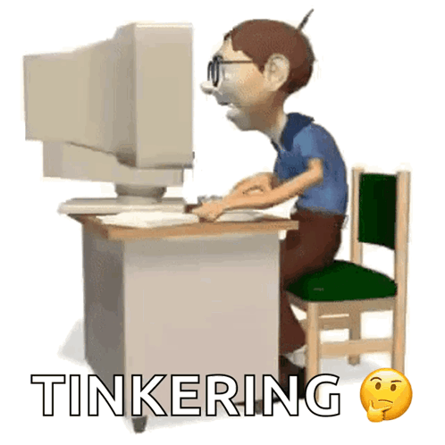
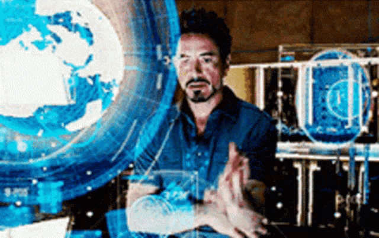

# Sobre Mim

Sou estudante de Ciência da Computação na UNIFEI, com interesse em **IA**, **sistemas complexos**, **descentralização** e **DevOps**.
Gosto de experimentar ideias diferentes e transformá-las em projetos práticos. Café é meu combustível e a música me ajuda a manter o foco.
Tenho um pouco de defict de atenção, o que às vezes significa pensar em dez coisas ao mesmo tempo, mas também me dá criatividade para caminhos fora do comum.

### Interesses

- **Música**: Gosto de vários estilos, como **rock**🎸, **rap**🎤, **pagode**🪕, **reggae** 🇪🇹 e **forró**🪗.
- **Série**: Minha favorita é **_Silicon Valley_**.
- **Hobbies**: Amo ir à praia e fazer trilhas🌄.

# Tecnologias

Tenho explorado ferramentas e linguagens que me ajudam a construir desde protótipos rápidos até sistemas mais complexos.
Atualmente venho aprendendo e praticando com Python, Flutter, FastAPI, PostgreSQL e Docker/Podman, além de me aventurar em conceitos de IA e computação distribuída. 

  <!-- Flutter -->
  
  
  <!-- FastAPI -->
  
  
  <!-- PostgreSQL -->
  
  
  <!-- Python -->
  
  
  <!-- Git -->
  
  
  <!-- Node.js -->
  

# Projetos e Estatísticas

Gosto de colocar a mão na massa em projetos que misturam curiosidade e desafio: desde sistemas distribuídos até experimentos com IA e automação.
O que aparece aqui no GitHub é um reflexo das minhas explorações, estudos e tentativas de transformar ideias em algo prático.
Nem tudo fica perfeito de primeira, mas é assim que vou aprendendo e evoluindo.

  
  

### Projetos Experimentais

Curto explorar ideias fora do comum e colocar em prática coisas que normalmente ficam só na teoria.
Alguns dos meus experimentos envolvem:

**Dark web** → criando ambientes de estudo para entender segurança, privacidade e anonimato.

**Descentralização** → testando soluções que fogem do modelo centralizado tradicional, desde mensageria até marketplaces.

**IA aplicada** → usando modelos para resolver problemas de forma criativa e, às vezes, inesperada.

**DevOps e automação** → porque nada melhor que ver processos rodando sozinhos depois de muito café e debug.

Não são projetos “de produção”, mas sim playgrounds onde aprendo, erro, ajusto e descubro novas possibilidades.

## Minhas Redes

Quer trocar uma ideia? Gosto de conversar sobre tecnologia, descentralização, projetos experimentais e inovação.
Pode me chamar:

  
  

### 🚀 Último Commit: Easter Egg

Se você chegou até aqui, parabéns! 👀  
Entre códigos, projetos e cafés infinitos, sempre gosto de deixar um toque pessoal: um pouco de humor sutil para quem realmente explora tudo.

- 🖥️ Momentos de programação na vida real:  
  

🤓 O típico **mlk digitando desesperado** tentando fazer tudo rodar direito:  

🤖 **Tony Stark no Jarvis**, mostrando como a gente sonha em codar:  
  
🤯 E claro, aquele **Homer ou figurante desesperado** batendo no PC quando nada funciona:  

<table>  
  <tr>
    <td></td>
    <td></td>
    <td></td>
  </tr>
  <tr>
    <td></td>
    <td></td>
    <td></td>
  </tr>

</table>

> Porque até os profissionais sérios merecem rir um pouco no final. 😎
  
<svg viewBox="0 0 1440 200" xmlns="http://www.w3.org/2000/svg">
  <path fill="#00000" fill-opacity="0.7">
    <animate 
      attributeName="d" 
      dur="8s" 
      repeatCount="indefinite"
      values="
        M0,100 C480,200 960,0 1440,100 L1440,200 L0,200 Z;
        M0,120 C480,0 960,200 1440,120 L1440,200 L0,200 Z;
        M0,100 C480,200 960,0 1440,100 L1440,200 L0,200 Z
      " />
  </path>
</svg>
